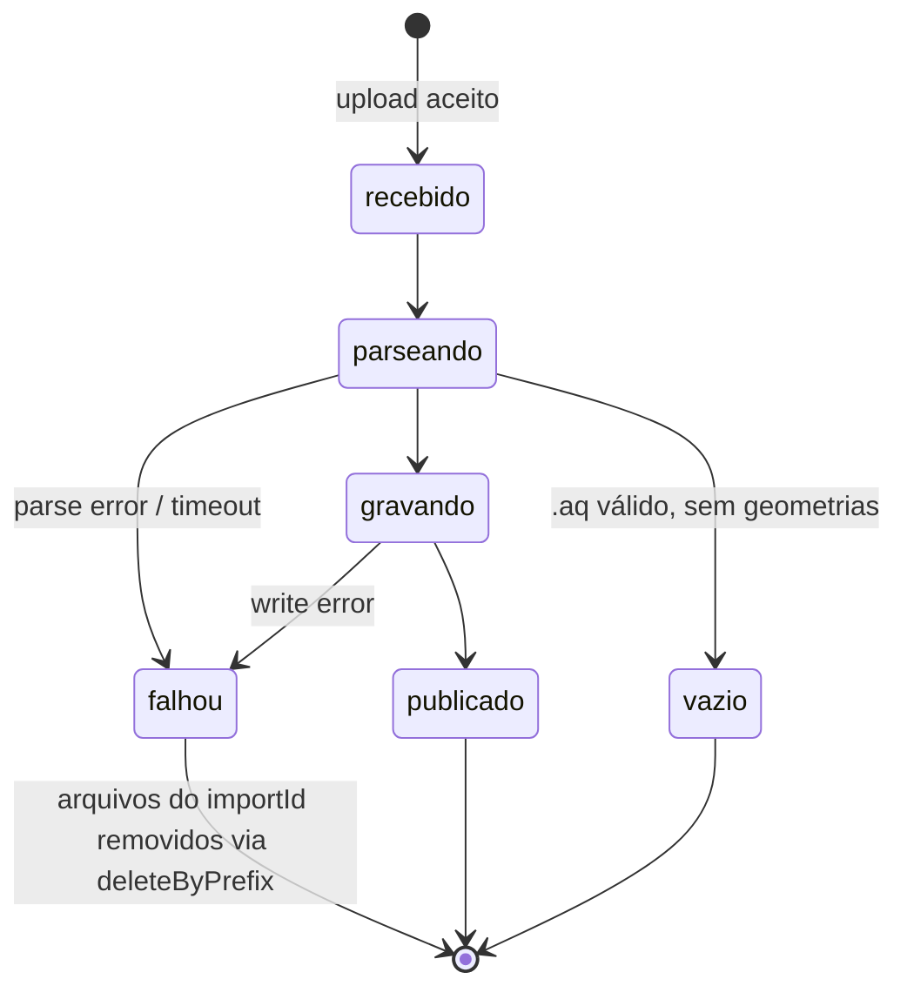

# S1.1 Schemas e GeometryStore — Plan

## Goal Capsule

- **Objetivo:** Instalar `@nestjs/mongoose`, definir os quatro schemas Mongoose (`companies`, `bim_catalogs`, `bim_products`, `bim_imports`) com índices, e criar a interface `IGeometryStore` com implementação em disco e smoke test.
- **Autoridade:** `docs/plano-produto-dinamico.md` é a fonte de verdade; este plano decompõe a sessão S1.1 em unidades executáveis.
- **Condições de parada:** não avançar para S1.2; não implementar rotas, upload, autenticação ou carga de dados reais; nenhuma mudança em `apps/web`.
- **Perfil de execução:** `ce-work` → `ce-code-review` → commit em `main`, sem push automático e sem PR.
- **Tail ownership:** criar `docs/sessoes/S1.1-schemas-geometry-store.md` e atualizar tabela de progresso (seção 11 do plano âncora) ao encerrar.

---

## Product Contract

### Summary

Instala `@nestjs/mongoose` no scaffold de S0, define quatro schemas Mongoose com os índices que as sessões posteriores dependem, e cria a interface `IGeometryStore` com implementação em disco verificada por smoke test standalone.

### Problem Frame

O scaffold de S0 tem NestJS mínimo: `GET /health` e conexão ao Atlas via driver `mongodb` direto. S1.1 adiciona a camada de dados que toda sessão seguinte consome — os schemas que descrevem o que vai ao banco e o contrato de storage que separa o que vai a arquivo. Sem esses contratos commitados, S1.2 (carga ponta a ponta) e S2.3 (importação e rotas de leitura) não têm onde gravar.

### Key Decisions

- **ADR-001 — geometria em arquivo, ponteiro no banco.** `bim_products` guarda `geoKey`/`thumbKey` como strings que referenciam o `GeometryStore`; os blobs não entram no MongoDB. Governa R3, R7, R8. *(Fechado pelo dono do projeto em 2026-08-29; ver seção 9 do plano âncora.)*

### Requirements

**Schemas e índices**

- R1. O schema `companies` define: `_id` (string UUID v4), `name` (string), `customUrl` (string, único), `ownerId` (string), `createdAt` (Date).
- R2. O schema `bim_catalogs` define: `_id`, `companyId`, `slug`, `title`, `manufacturer`, `layout`, `filters` (string[]), `productCount` (number), `createdAt`; índice único composto em `{companyId, slug}`.
- R3. O schema `bim_products` define: `_id`, `catalogId`, `importId`, `id` (string — slug do produto no `.aq`), `nome`, `serie` (opcional), `specs` (Record\<string, string\>), `curva` ([[number]] | null — pontos da curva Q-H), `conexoes` (opcional), `potencia` (opcional), `geoKey` (string), `thumbKey` (string, opcional), `createdAt`; índices em `{catalogId}`, `{catalogId, serie}` e `{importId}`.
- R4. O schema `bim_imports` define: `_id`, `companyId`, `catalogId` (opcional), `status` (enum: `recebido | parseando | gravando | publicado | vazio | falhou`), `error` (opcional), `productCount` (opcional), `fileName`, `createdAt`, `updatedAt`.
- R5. O índice `{companyId, status}` em `bim_imports` sustenta consulta de imports ativos por empresa.

**GeometryStore**

- R6. A interface `IGeometryStore` expõe: `put(key: string, data: Buffer): Promise<void>`, `get(key: string): Promise<Buffer>`, `delete(key: string): Promise<void>`, `deleteByPrefix(prefix: string): Promise<void>`.
- R7. A implementação em disco lê o diretório base de `STORAGE_PATH`; `put` cria subdiretórios automaticamente via `fs.mkdir({ recursive: true })`; `deleteByPrefix` remove todos os arquivos cujo caminho relativo ao base dir começa com o prefixo.
- R8. A troca para uma implementação S3 é uma linha no módulo NestJS (`useClass: DiskGeometryStore` → `useClass: S3GeometryStore`).

**Verificação**

- R9. Um script standalone em `www/tools/smoke-geometry-store.ts` executa: `put` de um buffer de teste, `get` confirmando conteúdo idêntico, `delete` confirmando remoção, `deleteByPrefix` sobre múltiplos arquivos de um mesmo prefixo. Termina com saída `OK` ou lança.

### Scope Boundaries

Fora de escopo desta sessão: rotas de leitura ou upload (S2.3), autenticação (S3.1), carga de dados reais de `.aq` (S1.2), e qualquer mudança em `apps/web`.

---

## Planning Contract

### Key Technical Decisions

- **KTD1. `@nestjs/mongoose` para todos os schemas; driver `mongodb` direto fica apenas em `health.controller.ts`.**
  Alinha com o padrão NestJS + Mongoose do `bilds.com`, habilita injeção de dependência e `MongooseModule.forFeature()`. Não conflita com o health check: `health.controller.ts` abre e fecha seu próprio `MongoClient` a cada request.

- **KTD2. `specs` em `bim_products` como `Schema.Types.Mixed` no Mongoose (`Record<string, string>` no TypeScript).** *(session-settled: user-directed — chosen over `{key, value}[]`: formato flat é idêntico ao `catalog.json` do pipeline Python; S2.3 filtra por `serie`, campo top-level, não por chaves de specs.)*

- **KTD3. `_id` como `string` com `default: () => crypto.randomUUID()` em todos os schemas.**
  Segue a convenção `bilds.com` (`_id: String`). `crypto.randomUUID()` é nativo no Node 24, sem dependência extra.

- **KTD4. `IGeometryStore` como provider NestJS via token string `'GEOMETRY_STORE'`.**
  `GeometryStoreModule` exporta `{ provide: 'GEOMETRY_STORE', useClass: DiskGeometryStore }`. A troca para S3 é trocar o `useClass` (per R8).

- **KTD5. `STORAGE_PATH` via `process.env.STORAGE_PATH` para o base dir do `DiskGeometryStore`.**
  Default: `path.join(process.cwd(), 'storage')` — resolve para `www/storage/` quando a API sobe do `www/`. O diretório não entra no git (`www/storage/` adicionado ao `.gitignore`).

- **KTD6. Schemas agrupados por entidade, registrados centralmente em `AppModule`.**
  Sem módulo NestJS separado por schema. A POC tem quatro entidades — feature modules introduzem boilerplate sem ganho real neste estágio. Revisado em S2.x se os schemas crescerem para incluir services e repositories.

### High-Level Technical Design

#### Máquina de estados de `bim_imports`

A máquina de estados governa o campo `status` do schema e a obrigação de cleanup no estado `falhou` via `GeometryStore.deleteByPrefix(importId)`. `vazio` é distinto de `falhou`: representa um `.aq` válido que não continha geometrias processáveis — sem erro, sem cleanup necessário.



**Por que o diagrama:** seis estados e sete transições. `falhou` tem obrigação de cleanup que S2.3 vai invocar — implementar sem o contrato visual aumenta o risco de omitir a chamada `deleteByPrefix`. `vazio` é fácil de confundir com `falhou` em prose; o diagrama torna a distinção explícita para todas as sessões futuras.

### Implementation Units

---

#### U1 — Instalar `@nestjs/mongoose` e configurar `MongooseModule.forRoot`

**Goal:** `@nestjs/mongoose` e `mongoose` instalados no workspace, e `AppModule` conectando ao Atlas pelo `MongooseModule.forRoot(process.env.MONGODB_URI)`.

**Requirements:** pré-condição para U2.

**Files:**
- `www/pnpm-workspace.yaml` — adicionar `'@nestjs/mongoose': true` ao `allowBuilds`
- `www/apps/api/package.json` — adicionar `@nestjs/mongoose`, `mongoose`
- `www/apps/api/src/app.module.ts` — importar `MongooseModule.forRoot`

**Approach:**

1. Adicionar `'@nestjs/mongoose': true` ao bloco `allowBuilds` em `pnpm-workspace.yaml`. (pnpm 11 exige aprovação explícita de postinstall scripts — lição de S0.)
2. Instalar: `pnpm --filter api add @nestjs/mongoose mongoose`.
3. Em `app.module.ts`, adicionar `MongooseModule.forRoot(process.env.MONGODB_URI)` ao array de `imports`. A URI já está em `process.env` quando `AppModule` inicializa, carregada pelo `dotenv.config()` no topo de `main.ts`.
4. `health.controller.ts` não precisa de alteração — usa driver `mongodb` direto, independente do Mongoose.

**Patterns:** `main.ts` carrega `www/.env` via `dotenv.config({ path: resolve(__dirname, '../../../.env') })` antes de qualquer import do NestJS. Esse padrão já está em produção; não alterar.

**Test scenarios:**
- `pnpm dev:api` sobe sem erro de conexão ao Mongoose ou ao Atlas.
- `GET /health` continua respondendo `{"status":"ok","mongo":"8.0.30"}`.
- `tsc --noEmit` em `www/apps/api` compila sem erros de tipo.

---

#### U2 — Schemas Mongoose: companies, bim\_catalogs, bim\_products, bim\_imports

**Goal:** quatro schemas compilando com índices declarados, registrados no `MongooseModule.forFeature`.

**Requirements:** R1, R2, R3, R4, R5 (per KTD3, KTD6).

**Dependencies:** U1.

**Files:**
- `www/apps/api/src/companies/companies.schema.ts`
- `www/apps/api/src/bim-catalogs/bim-catalogs.schema.ts`
- `www/apps/api/src/bim-products/bim-products.schema.ts`
- `www/apps/api/src/bim-imports/bim-imports.schema.ts`
- `www/apps/api/src/app.module.ts` — registrar schemas no `MongooseModule.forFeature`

**Approach:**

Cada arquivo de schema:
- Exporta uma classe decorada com `@Schema({ collection: '<nome>' })` e um `SchemaFactory.createForClass()`.
- Declara `_id` com `@Prop({ type: String, default: () => crypto.randomUUID() })`.
- Usa `@Prop()` para campos simples e `@Prop({ type: mongoose.Schema.Types.Mixed })` para `specs` e `curva` em `bim_products`.
- Declara `status` em `bim_imports` com `@Prop({ type: String, enum: ['recebido', 'parseando', 'gravando', 'publicado', 'vazio', 'falhou'] })`.
- Índices compostos são adicionados via `schema.index(...)` no arquivo de schema após `SchemaFactory.createForClass()` (preferível ao `@Prop({ index: true })` para índices compostos e únicos compostos).

`updatedAt` em `bim_imports` é declarado como `@Prop({ type: Date })` e gerenciado explicitamente no código (não via `timestamps: true` do Mongoose — o `updatedAt` reflete a última transição de estado, que deve ser intencional).

`AppModule` registra todos os schemas em um único `MongooseModule.forFeature([...])` (per KTD6).

**Patterns to follow:** `bilds.com` usa `_id: String` com UUID. Usar `crypto.randomUUID()` nativo (Node 24) em vez do pacote `uuid`.

**Test scenarios:**
- Happy path: `tsc --noEmit` compila sem erros.
- `bim_products` tem 3 índices declarados: `{catalogId: 1}`, `{catalogId: 1, serie: 1}`, `{importId: 1}`.
- `bim_catalogs` tem índice único em `{companyId: 1, slug: 1}`.
- `bim_imports` aceita todos os seis valores de `status` e rejeita valores fora do enum (validação Mongoose em runtime).
- API sobe após U2 sem erros de validação de schema.

---

#### U3 — IGeometryStore, DiskGeometryStore e smoke test

**Goal:** interface TypeScript `IGeometryStore` com implementação em disco registrada como provider NestJS, e smoke test passando.

**Requirements:** R6, R7, R8, R9.

**Dependencies:** independente de U1 e U2 — pode rodar em qualquer ordem.

**Files:**
- `www/apps/api/src/geometry-store/geometry-store.interface.ts`
- `www/apps/api/src/geometry-store/disk-geometry-store.ts`
- `www/apps/api/src/geometry-store/geometry-store.module.ts`
- `www/apps/api/src/app.module.ts` — importar `GeometryStoreModule`
- `www/tools/smoke-geometry-store.ts`
- `www/.gitignore` — adicionar `storage/` se não estiver

**Approach:**

`geometry-store.interface.ts` — interface TypeScript pura, sem decoradores:
```
export interface IGeometryStore {
  put(key: string, data: Buffer): Promise<void>;
  get(key: string): Promise<Buffer>;
  delete(key: string): Promise<void>;
  deleteByPrefix(prefix: string): Promise<void>;
}
```

`DiskGeometryStore` implementa `IGeometryStore`. Lê `STORAGE_PATH` de `process.env`. Para `deleteByPrefix`: usa `fs.readdir(baseDir, { recursive: true })` (nativo no Node 18+, sem dependência extra), filtra os caminhos que começam com o prefixo, e remove cada arquivo via `fs.unlink`.

`GeometryStoreModule`:
```
@Module({
  providers: [{ provide: 'GEOMETRY_STORE', useClass: DiskGeometryStore }],
  exports: ['GEOMETRY_STORE'],
})
```

`AppModule` importa `GeometryStoreModule`.

`www/tools/smoke-geometry-store.ts` — script standalone que importa `DiskGeometryStore` diretamente (sem NestJS), configura `STORAGE_PATH` para um subdiretório temporário dentro de `www/storage/smoke-test/`, e executa as operações do R9. Remove o diretório de teste ao final. Imprime `OK` na última linha ou lança.

O script é executado via:
```bash
cd www && node --require ts-node/register --require reflect-metadata tools/smoke-geometry-store.ts
```

Adicionar ao `www/package.json` (scripts do workspace root):
```json
"smoke:geo": "node --require ts-node/register --require reflect-metadata tools/smoke-geometry-store.ts"
```

**Patterns to follow:** comando `node --require ts-node/register --require reflect-metadata` documentado em S0 como a forma correta de rodar TypeScript com decoradores em Node 24.

**Test scenarios:**
- Happy path: `put('geo/import1/piece.json', buffer)` → `get('geo/import1/piece.json')` → conteúdo idêntico ao buffer gravado.
- `delete('geo/import1/piece.json')` → arquivo não existe mais no filesystem.
- `put('geo/import1/a.bin')` + `put('geo/import1/b.bin')` + `put('geo/import2/c.bin')` → `deleteByPrefix('geo/import1/')` → `geo/import1/a.bin` e `geo/import1/b.bin` removidos; `geo/import2/c.bin` intacto.
- `put` em chave com subdiretório inexistente (`nested/deep/file.bin`): cria os diretórios automaticamente.
- `get` em chave inexistente: lança com `ENOENT` (não retorna `undefined`).
- Smoke test imprime `OK` e encerra com exit code 0.

---

### Verification Contract

```bash
# TypeScript
cd www/apps/api && npx tsc --noEmit
# Deve encerrar sem erros (exit 0)

# API startup + health
cd www && pnpm dev:api
# Em outra aba:
curl http://localhost:4000/health
# → {"status":"ok","mongo":"8.0.30"}

# Smoke test do GeometryStore
cd www && pnpm smoke:geo
# → última linha: OK
```

### Definition of Done

1. `tsc --noEmit` passa sem erros em `www/apps/api`.
2. `MongooseModule.forRoot` conecta ao Atlas sem erro ao subir a API.
3. `GET /health` continua respondendo `{"status":"ok","mongo":"8.0.30"}` (smoke de regressão).
4. Smoke test do `GeometryStore` imprime `OK` sem exceção.
5. Índices declarados nos schemas: `bim_products` com 3 índices, `bim_catalogs` com 1 índice composto único.
6. Registro de sessão criado em `docs/sessoes/S1.1-schemas-geometry-store.md` seguindo o template.
7. Tabela de progresso (seção 11 do plano âncora) atualizada com S1.1 como `concluída`.
8. Commit em `main` — sem push, sem PR.
